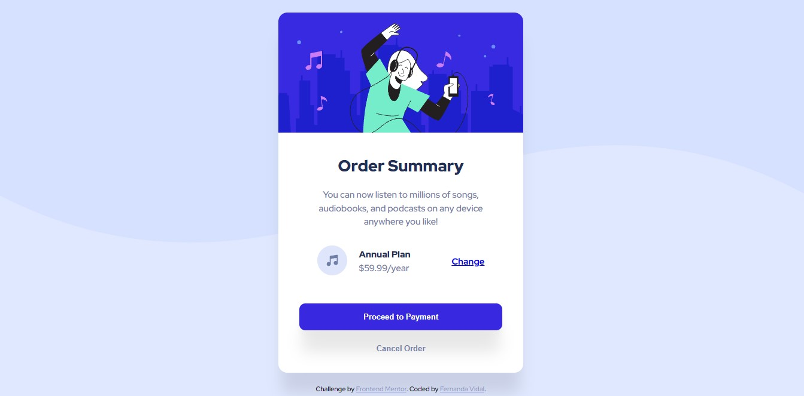

# Frontend Mentor - Order summary card solution

This is a solution to the [Order summary card challenge on Frontend Mentor](https://www.frontendmentor.io/challenges/order-summary-component-QlPmajDUj). Frontend Mentor challenges help you improve your coding skills by building realistic projects. 

## Table of contents

- [Overview](#overview)
  - [The challenge](#the-challenge)
  - [Screenshot](#screenshot)
  - [Links](#links)
- [My process](#my-process)
  - [Built with](#built-with)
- [Author](#author)

## Overview

### The challenge

Users should be able to:

- See hover states for interactive elements

### Screenshot

### Links

- Solution URL: [ Order summary card solution](https://www.frontendmentor.io/solutions/order-summary-card-solution-_RAPyvjud)
- Live Site URL: [ Order summary card solution](https://order-summary-component-main-rust.vercel.app/)

## My process

### Built with

- Semantic HTML5 markup
- CSS custom properties
- Flexbox
- Media Queries

## Author

- GitHub - [ifdotcom](https://github.com/ifdotcom)
- Frontend Mentor - [@ifdotcom](https://www.frontendmentor.io/profile/ifdotcom)

